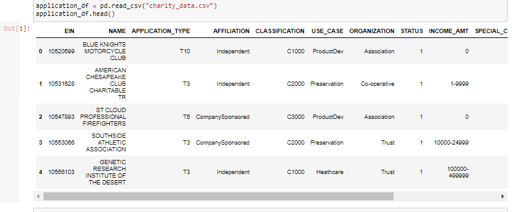
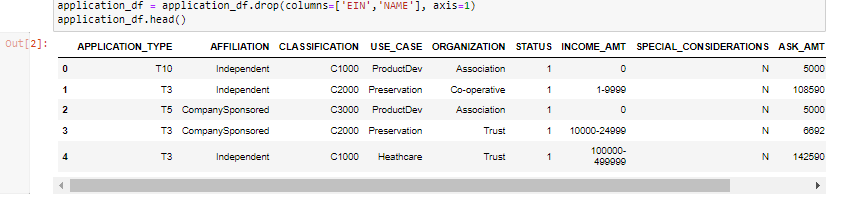
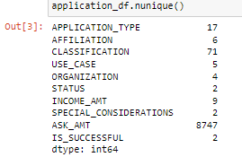
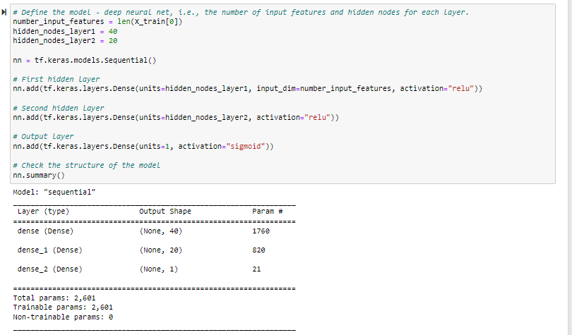
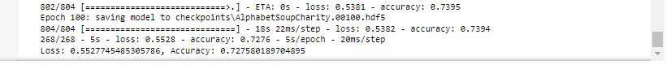
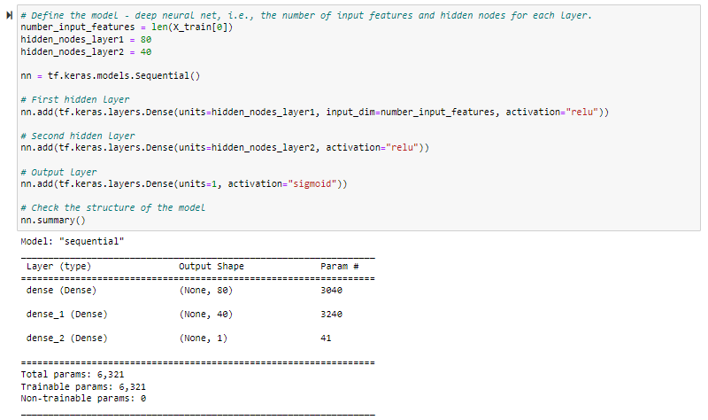
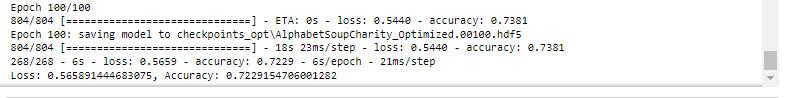
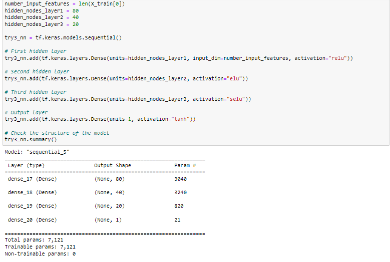
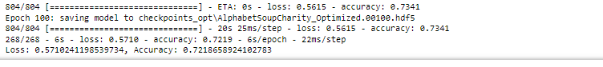

# Neural_Network_Charity_Analysis
## Overview
In this project we will be looking at a dataset containing over 34,000 organzations that received funding from Alphabet Soup. The objective is to create a neural network that help predict if a specific project is likely to fail or succeed, and thus, make better decisions when funding said projects.
## Results
Data preprocessing. At first glance columns EIN and NAME pop out immediatly as not needed. Out target is the column IS_SUCCESSFUL.

  
  
  

For our first model, the input layer has the same amount of nodes as features, 2 hidden layers with 40 and 20 nodes and relu as the activation function, the output layer has sigmoid as activation function.
  
  
  
  
  
  